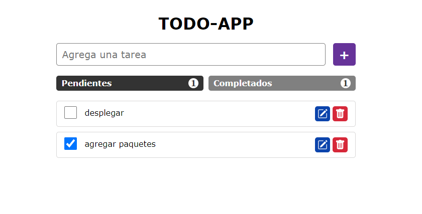

# TODO-APP

La clásica aplicación To-Do donde un usuario puede anotar todas las cosas que quiere lograr.

Demo: [TODO-APP](https://todo-app-gsusvs.netlify.app/)



## Configuaraciones 

Para inicializar el proyecto, primero instalar yarn.
```sh
npm install yarn -g
```
Luego intalar los paquetes del proyecto.
```sh
yarn add
```
Una vez configurado ejecutar el proyecto.
```sh
yarn dev
```

[Jest config](https://gist.github.com/Klerith/ca7e57fae3c9ab92ad08baadc6c26177)